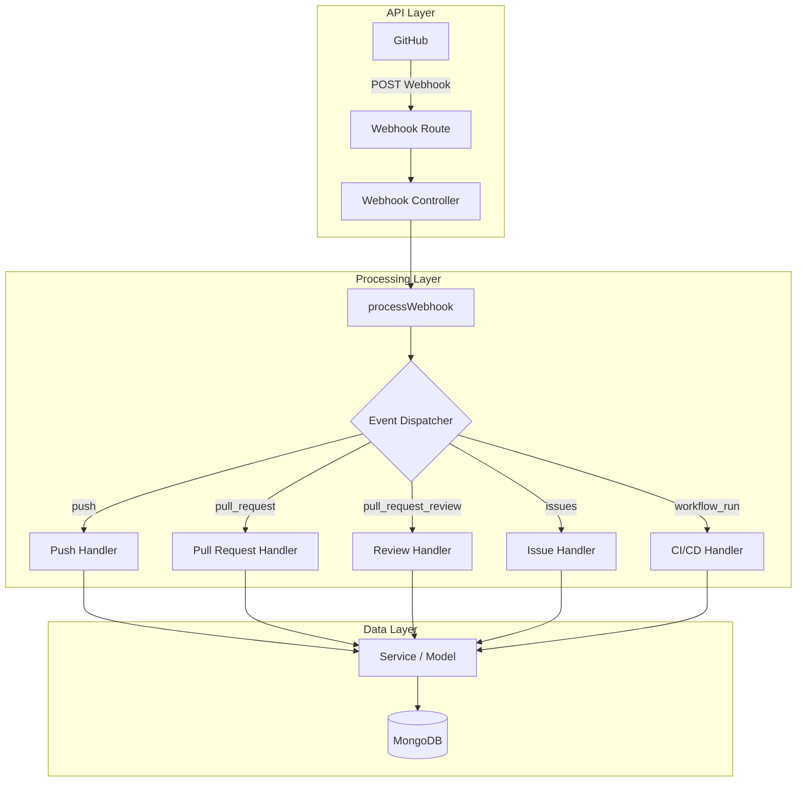
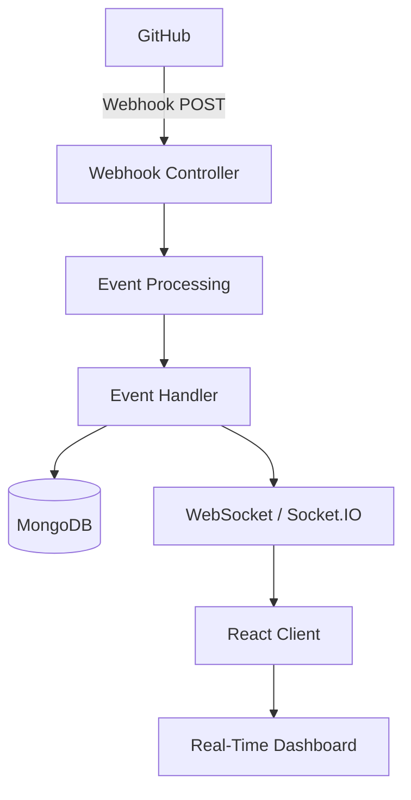

# GitHub Monitor

GitHub Monitor is a repository activity monitoring system that receives GitHub Webhook events, processes and normalizes the incoming data, stores relevant activity in MongoDB, and provides a real-time monitoring dashboard.

The main goal of this project is to explore event-driven backend architecture, webhook integration, data normalization, persistence, analytics, and real-time communication.

---

## Project Overview

Instead of continuously polling the GitHub API to check whether something has changed, GitHub Monitor uses GitHub Webhooks.

Whenever an important event occurs in a monitored repository, GitHub automatically sends an HTTP POST request to the GitHub Monitor backend.

```text
GitHub Repository
       |
       | Event occurs
       v
GitHub Webhook
       |
       | HTTP POST
       v
GitHub Monitor API
       |
       v
Event Processing
       |
       v
MongoDB
       |
       v
WebSocket
       |
       v
React Dashboard
```

> **Note:** GitHub Webhooks allow GitHub to automatically send event information to a configured endpoint when repository activity occurs.

---

## Initial Plan

The first stage of the project is to receive the GitHub Webhook request, identify the event type, extract the required information from the payload, normalize it, and store the processed data.

The initial processing flow is:

```text
GitHub
   |
   | POST Webhook
   v
Webhook Route
   |
   v
Webhook Controller
   |
   v
processWebhook()
   |
   v
Event Dispatcher
   |
   +-------> Push Handler
   |
   +-------> Pull Request Handler
   |
   +-------> Review Handler
   |
   +-------> Issue Handler
   |
   +-------> CI/CD Handler
   |
   v
Normalized Event
   |
   v
Service / Model
   |
   v
MongoDB
```

---

## GitHub Webhook

GitHub sends webhook events to the configured endpoint using an HTTP POST request.

The Express application receives the request through the webhook route.

The event type is available through the request header:

```javascript
req.headers["x-github-event"]
```

The webhook payload is available through:

```javascript
req.body
```

For example:

```javascript
const createwebhook = (req, res) => {
    const event = req.headers["x-github-event"];
    const payload = req.body;

    console.log("Event:", event);
    console.log("Payload:", payload);

    res.status(200).json({
        message: "Webhook received"
    });
};
```

---

## Webhook Payload

A GitHub `push` event contains information similar to:

```json
{
    "ref": "refs/heads/testbranch",
    "before": "...",
    "after": "...",
    "repository": {},
    "pusher": {},
    "commits": [],
    "head_commit": {}
}
```

The payload contains many nested objects and fields. GitHub Monitor will not directly use the entire payload throughout the application.

Instead, relevant information will be extracted and normalized into an application-specific structure.

### Important Push Payload Fields

| Field | Responsibility |
| :--- | :--- |
| `ref` | Identifies the affected branch or reference |
| `before` | Commit SHA before the push |
| `after` | Commit SHA after the push |
| `repository` | Repository information such as ID, name and owner |
| `pusher` | Information about the user who performed the push |
| `commits` | Array containing all commits included in the push |
| `head_commit` | Information about the latest commit |
| `compare` | URL for comparing the changes |
| `forced` | Indicates whether the push was forced |
| `created` | Indicates whether a branch or tag was created |
| `deleted` | Indicates whether a branch or tag was deleted |

---

## Event Processing

After the webhook controller receives the request, the event is passed to `processWebhook()`.

The processing layer is responsible for identifying the event and passing it to the appropriate handler.

```text
Controller
    |
    v
processWebhook()
    |
    v
Event Dispatcher
    |
    +---- push ------------> Push Handler
    |
    +---- pull_request ----> Pull Request Handler
    |
    +---- review ----------> Review Handler
    |
    +---- issues ----------> Issue Handler
    |
    +---- workflow_run ----> CI/CD Handler
```

The event dispatcher will prevent the webhook controller from becoming responsible for processing every type of GitHub event.

---

## Event Types

GitHub Monitor is planned to support several categories of repository activity.

### Code

- `push`
- `create`
- `delete`

### Pull Requests

- `pull_request`
- `pull_request_review`

### Issues

- `issues`
- `issue_comment`

### CI/CD

- `workflow_run`
- `workflow_job`
- `deployment_status`

### Releases

- `release`

The implementation will be introduced incrementally rather than supporting every GitHub event from the beginning.

---

## Payload Normalization

Different GitHub events contain different payload structures.

For example:

```text
push
 |
 +-- repository
 +-- ref
 +-- commits
 +-- pusher
```

while:

```text
pull_request
 |
 +-- repository
 +-- action
 +-- pull_request
 +-- sender
```

To avoid coupling the rest of the application directly to GitHub's payload format, the event handlers will normalize the required information.

For example, a normalized push event could look like:

```javascript
{
    type: "push",

    repository: {
        id: 123,
        name: "username/repository"
    },

    actor: {
        username: "developer"
    },

    branch: "main",

    timestamp: "2026-08-23T10:30:00Z",

    data: {
        commitCount: 2,
        commits: []
    }
}
```

This normalized structure can then be passed to the service or model layer.

---

## Backend Architecture



---

## MongoDB Persistence

After the event is normalized, the relevant information will be stored in MongoDB.

The application will store useful application-level data rather than depending on the complete raw GitHub payload.

The stored information may include:

```text
Event
 |
 +-- Type
 +-- Repository
 +-- Actor
 +-- Timestamp
 +-- Branch
 +-- Commit Information
 +-- Pull Request Information
 +-- Issue Information
 +-- CI/CD Information
```

The database will provide the historical data required by the monitoring dashboard and analytics APIs.

---

## REST API

The frontend will communicate with the backend through REST APIs.

Planned endpoints include:

```text
GET /api/repositories
GET /api/repositories/:id
GET /api/events
GET /api/events/:id
GET /api/repositories/:id/activity
GET /api/repositories/:id/analytics
```

These APIs will provide repository activity, historical events, and aggregated statistics.

---

## Monitoring Dashboard

The frontend will provide a repository monitoring dashboard.

The dashboard is planned to display information such as:

```text
Repository Overview
----------------------------

Commits              128
Pull Requests         34
Open Issues           12
CI Success Rate       91%
Deployments             8
```

It will also contain an activity timeline:

```text
Recent Activity
----------------------------

10:42  Push
       2 commits pushed to main

10:35  Pull Request
       PR #42 merged

10:21  Review
       PR #43 approved

09:58  Issue
       Issue #18 opened

09:40  CI/CD
       Build succeeded
```

---

## Repository Analytics

GitHub Monitor will provide repository-level analytics based on the processed events.

Possible metrics include:

- Total commits
- Commit activity
- Pull Requests
- Pull Request merge rate
- Open issues
- Closed issues
- Contributor activity
- CI success rate
- CI failure rate
- Workflow duration
- Deployment status
- Repository activity trends

The goal is to transform raw repository events into useful information about repository activity.

---

## Real-Time Updates

A planned feature of GitHub Monitor is real-time dashboard updates.

Without real-time communication, the frontend would need to request updated information from the backend periodically or after a user refreshes the page.

The planned architecture uses WebSocket communication between the backend and frontend.

```text
GitHub
   |
   v
Webhook
   |
   v
Event Processing
   |
   +----------------> MongoDB
   |
   +----------------> WebSocket
                          |
                          v
                    React Dashboard
```

When a new GitHub event is successfully processed, the backend can broadcast the normalized event to connected clients.

```text
GitHub Push
     |
     v
Webhook
     |
     v
Event Processing
     |
     v
MongoDB
     |
     v
WebSocket
     |
     v
React
     |
     v
Dashboard updates instantly
```

This allows new repository activity to appear without manually refreshing the page.

---

## Planned Real-Time Architecture



WebSocket communication will be used for events such as:

- New commits
- Pull Request updates
- Review activity
- Issue activity
- CI/CD status changes
- Deployment status changes

---

## Webhook Security

The production implementation will verify GitHub's webhook signature before processing the request.

```text
GitHub
   |
   | Signed Webhook
   v
Webhook Endpoint
   |
   v
Signature Verification
   |
   +---- Invalid ----> Reject
   |
   +---- Valid ------> Event Processing
```

This prevents unauthorized clients from sending arbitrary webhook events to the application.

---

## Technology Stack

### Backend

- Node.js
- Express.js
- MongoDB
- Mongoose

### Frontend

- React

### Communication

- REST API
- GitHub Webhooks
- WebSocket / Socket.IO

### Development

- ngrok
- GitHub

---

## Planned Backend Structure

```text
backend/
|
+-- src/
|   |
|   +-- routes/
|   |   +-- webhook.routes.js
|   |
|   +-- controllers/
|   |   +-- webhook.controller.js
|   |
|   +-- services/
|   |   +-- webhook.service.js
|   |
|   +-- handlers/
|   |   +-- push.handler.js
|   |   +-- pullRequest.handler.js
|   |   +-- review.handler.js
|   |   +-- issue.handler.js
|   |   +-- workflowRun.handler.js
|   |
|   +-- utils/
|   |   +-- eventDispatcher.js
|   |
|   +-- models/
|   |   +-- event.model.js
|   |
|   +-- config/
|       +-- database.js
|
+-- server.js
```

---

## Development Roadmap

### Phase 1 — Webhook Foundation

- [x] Express server
- [x] MongoDB connection
- [x] GitHub Webhook endpoint
- [x] Receive webhook requests
- [x] Detect GitHub event type
- [x] Receive `push` events
- [x] Inspect webhook payload

### Phase 2 — Event Processing

- [ ] Create `processWebhook()`
- [ ] Create event dispatcher
- [ ] Create push handler
- [ ] Normalize push events
- [ ] Add Pull Request handler
- [ ] Add Pull Request Review handler
- [ ] Add Issue handler
- [ ] Add CI/CD handler

### Phase 3 — Persistence

- [ ] Design MongoDB schema
- [ ] Store normalized events
- [ ] Repository queries
- [ ] Activity queries
- [ ] Analytics queries

### Phase 4 — REST API

- [ ] Repository API
- [ ] Activity API
- [ ] Event filtering
- [ ] Analytics API

### Phase 5 — Frontend

- [ ] Repository dashboard
- [ ] Activity timeline
- [ ] Event filtering
- [ ] Repository analytics
- [ ] CI/CD monitoring
- [ ] Charts and visualizations

### Phase 6 — Real-Time Monitoring

- [ ] WebSocket / Socket.IO server
- [ ] Client connection management
- [ ] Event broadcasting
- [ ] Real-time activity updates
- [ ] Live CI/CD status
- [ ] Real-time dashboard updates

### Phase 7 — Production Improvements

- [ ] GitHub webhook signature verification
- [ ] Request validation
- [ ] Error handling
- [ ] Logging
- [ ] Rate limiting
- [ ] Deployment
- [ ] Environment configuration

---

## Current Status

**Current Phase: Phase 1 — Webhook Foundation**

Currently implemented:

- GitHub Webhook integration
- Express webhook endpoint
- ngrok local development
- GitHub event detection
- `push` event reception
- Webhook payload inspection

### Current Next Step

```text
Push Event
    |
    v
processWebhook()
    |
    v
Event Dispatcher
    |
    v
Push Handler
    |
    v
Normalize Payload
    |
    v
MongoDB
```

---

## Project Purpose

GitHub Monitor is being developed as a backend-focused showcase project to demonstrate practical software engineering concepts:

- Webhook integration
- Event-driven architecture
- REST API design
- Event dispatching
- Payload normalization
- MongoDB data modeling
- Service-layer architecture
- GitHub integration
- CI/CD monitoring
- Real-time communication
- WebSocket architecture
- Data analytics
- Frontend/backend integration

---

## Project Status

This project is actively under development.

The architecture and roadmap may evolve as new features are implemented.
