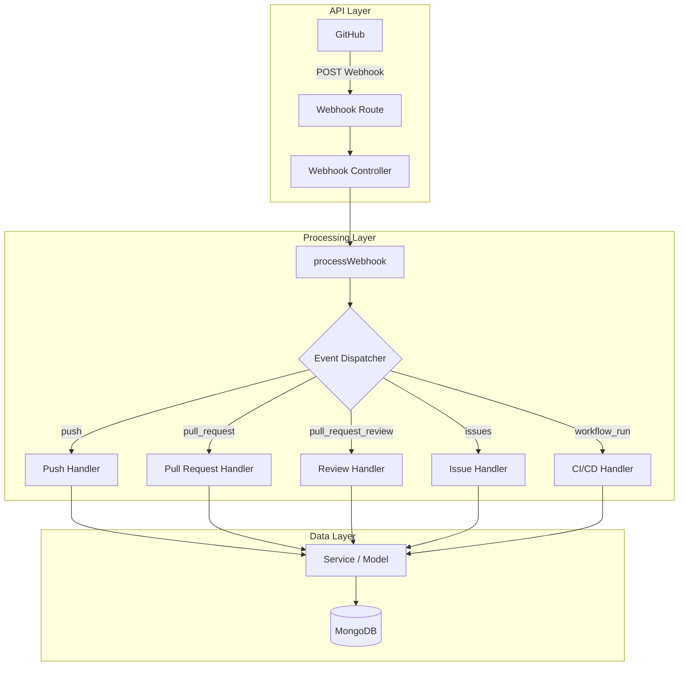
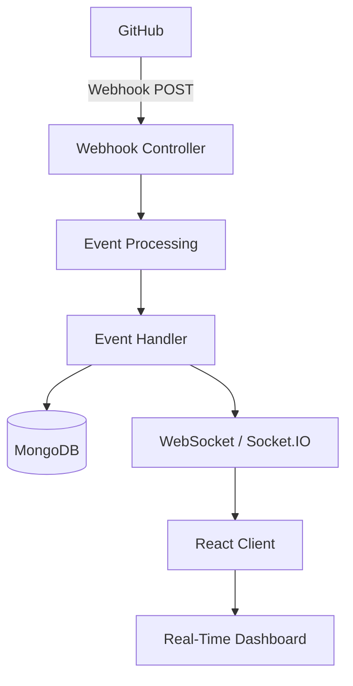

# GitHub Monitor

GitHub Monitor is a project to monitor the activities happening in a GitHub repository.

In this project, we use GitHub Webhooks to receive repository events automatically. When something happens in the repository, GitHub sends a POST request to our backend with the event details.

---

## Project Overview

Instead of continuously checking GitHub for changes, we use Webhooks.

```text
GitHub Repository
       |
       | Event happens
       v
GitHub Webhook
       |
       | HTTP POST
       v
GitHub Monitor API
       |
       v
Event Processing
       |
       v
MongoDB
       |
       v
WebSocket
       |
       v
React Dashboard
```

> **Note:** Webhooks are used to get repository events automatically. When an event happens in GitHub, GitHub sends the webhook request to our backend.

---

## Initial Plan

The first thing I want to do is receive the webhook body from GitHub, find which event it is, and then normalize the required data.

The initial flow is:

```text
GitHub
   |
   | POST Webhook
   v
Webhook Route
   |
   v
Webhook Controller
   |
   v
processWebhook()
   |
   v
Event Dispatcher
   |
   +-------> Push Handler
   |
   +-------> Pull Request Handler
   |
   +-------> Review Handler
   |
   +-------> Issue Handler
   |
   +-------> CI/CD Handler
   |
   v
Normalized Event
   |
   v
Service / Model
   |
   v
MongoDB
```

---

## GitHub Webhook

GitHub sends the webhook to our backend using a POST request.

The Express application receives the request through the webhook route.

We can get the event type from the request header:

```javascript
req.headers["x-github-event"]
```

We can get the webhook body using:

```javascript
req.body
```

For example:

```javascript
const createwebhook = (req, res) => {
    const event = req.headers["x-github-event"];
    const payload = req.body;

    console.log("Event:", event);
    console.log("Payload:", payload);

    res.status(200).json({
        message: "Webhook received"
    });
};
```

---

## Webhook Payload

For example, a GitHub `push` event contains data like:

```json
{
    "ref": "refs/heads/testbranch",
    "before": "...",
    "after": "...",
    "repository": {},
    "pusher": {},
    "commits": [],
    "head_commit": {}
}
```

The payload contains a lot of information. We don't need to use everything from the payload.

We will take the important details and convert them into our own format.

### Important Push Payload Fields

| Field | What it contains |
| :--- | :--- |
| `ref` | The branch or reference where the push happened |
| `before` | Commit SHA before the push |
| `after` | Commit SHA after the push |
| `repository` | Repository details like ID, name and owner |
| `pusher` | Details about the person who pushed |
| `commits` | All commits included in the push |
| `head_commit` | Details about the latest commit |
| `compare` | URL to compare the changes |
| `forced` | Tells whether the push was forced |
| `created` | Tells whether a branch or tag was created |
| `deleted` | Tells whether a branch or tag was deleted |

---

## Event Processing

After receiving the webhook, the controller will pass the event to `processWebhook()`.

`processWebhook()` will send the event to the correct handler using the event dispatcher.

```text
Controller
    |
    v
processWebhook()
    |
    v
Event Dispatcher
    |
    +---- push ------------> Push Handler
    |
    +---- pull_request ----> Pull Request Handler
    |
    +---- review ----------> Review Handler
    |
    +---- issues ----------> Issue Handler
    |
    +---- workflow_run ----> CI/CD Handler
```

This keeps the controller simple instead of putting all event processing code inside it.

---

## Event Types

I am planning to support these main GitHub events.

### Code

- `push`
- `create`
- `delete`

### Pull Requests

- `pull_request`
- `pull_request_review`

### Issues

- `issues`
- `issue_comment`

### CI/CD

- `workflow_run`
- `workflow_job`
- `deployment_status`

### Releases

- `release`

I will add these events one by one instead of trying to implement everything at once.

---

## Payload Normalization

Different GitHub events have different payload structures.

For example:

```text
push
 |
 +-- repository
 +-- ref
 +-- commits
 +-- pusher
```

while a pull request event looks more like:

```text
pull_request
 |
 +-- repository
 +-- action
 +-- pull_request
 +-- sender
```

Because of this, each handler will take the useful information from the GitHub payload and convert it into a format that our application can use.

For example, a normalized push event could look like:

```javascript
{
    type: "push",

    repository: {
        id: 123,
        name: "username/repository"
    },

    actor: {
        username: "developer"
    },

    branch: "main",

    timestamp: "2026-08-23T10:30:00Z",

    data: {
        commitCount: 2,
        commits: []
    }
}
```

This normalized data can then be passed to the service or model layer.

---

## Backend Architecture



---

## MongoDB

After processing and normalizing the event, the useful data will be stored in MongoDB.

I don't want to store the whole GitHub payload and use it everywhere. Instead, I want to store the data that GitHub Monitor actually needs.

For example:

```text
Event
 |
 +-- Type
 +-- Repository
 +-- Actor
 +-- Timestamp
 +-- Branch
 +-- Commit Information
 +-- Pull Request Information
 +-- Issue Information
 +-- CI/CD Information
```

This data can later be used for the activity page and analytics.

---

## REST API

The frontend will get the stored information through REST APIs.

Some planned APIs are:

```text
GET /api/repositories
GET /api/repositories/:id
GET /api/events
GET /api/events/:id
GET /api/repositories/:id/activity
GET /api/repositories/:id/analytics
```

These APIs will be used to get repository activity, old events, and analytics.

---

## Monitoring Dashboard

The frontend will show the activities happening in the repository.

For example:

```text
Repository Overview
----------------------------

Commits              128
Pull Requests         34
Open Issues           12
CI Success Rate       91%
Deployments             8
```

It can also show an activity timeline:

```text
Recent Activity
----------------------------

10:42  Push
       2 commits pushed to main

10:35  Pull Request
       PR #42 merged

10:21  Review
       PR #43 approved

09:58  Issue
       Issue #18 opened

09:40  CI/CD
       Build succeeded
```

---

## Repository Analytics

After collecting enough events, the project can show some repository statistics.

Some possible metrics are:

- Total commits
- Commit activity
- Pull Requests
- Pull Request merge rate
- Open issues
- Closed issues
- Contributor activity
- CI success rate
- CI failure rate
- Workflow duration
- Deployment status
- Repository activity trends

The idea is to convert the raw GitHub events into useful information about the repository.

---

## Real-Time Updates

One of the planned features is to update the dashboard without refreshing the page.

Without WebSocket, the frontend would need to request the backend again to check whether something new happened.

With WebSocket, the backend can directly send the new event to the connected frontend.

```text
GitHub
   |
   v
Webhook
   |
   v
Event Processing
   |
   +----------------> MongoDB
   |
   +----------------> WebSocket
                          |
                          v
                    React Dashboard
```

For example:

```text
GitHub Push
     |
     v
Webhook
     |
     v
Event Processing
     |
     v
MongoDB
     |
     v
WebSocket
     |
     v
React
     |
     v
Dashboard updates instantly
```

This means the user does not need to refresh the page to see a new repository activity.

---

## Planned Real-Time Architecture



WebSocket can be used for:

- New commits
- Pull Request updates
- Review activity
- Issue activity
- CI/CD status changes
- Deployment status changes

---

## Webhook Security

Later, I will verify GitHub's webhook signature before processing the request.

```text
GitHub
   |
   | Signed Webhook
   v
Webhook Endpoint
   |
   v
Signature Verification
   |
   +---- Invalid ----> Reject
   |
   +---- Valid ------> Event Processing
```

This will make sure random clients cannot simply send fake GitHub events to the webhook endpoint.

---

## Technology Stack

### Backend

- Node.js
- Express.js
- MongoDB
- Mongoose

### Frontend

- React

### Communication

- REST API
- GitHub Webhooks
- WebSocket / Socket.IO

### Development

- ngrok
- GitHub

---

## Planned Backend Structure

```text
backend/
|
+-- src/
|   |
|   +-- routes/
|   |   +-- webhook.routes.js
|   |
|   +-- controllers/
|   |   +-- webhook.controller.js
|   |
|   +-- services/
|   |   +-- webhook.service.js
|   |
|   +-- handlers/
|   |   +-- push.handler.js
|   |   +-- pullRequest.handler.js
|   |   +-- review.handler.js
|   |   +-- issue.handler.js
|   |   +-- workflowRun.handler.js
|   |
|   +-- utils/
|   |   +-- eventDispatcher.js
|   |
|   +-- models/
|   |   +-- event.model.js
|   |
|   +-- config/
|       +-- database.js
|
+-- server.js
```

---

## Development Roadmap

### Phase 1 — Webhook Foundation

- [x] Express server
- [x] MongoDB connection
- [x] GitHub Webhook endpoint
- [x] Receive webhook requests
- [x] Detect GitHub event type
- [x] Receive `push` events
- [x] Inspect webhook payload

### Phase 2 — Event Processing

- [ ] Create `processWebhook()`
- [ ] Create event dispatcher
- [ ] Create push handler
- [ ] Normalize push events
- [ ] Add Pull Request handler
- [ ] Add Pull Request Review handler
- [ ] Add Issue handler
- [ ] Add CI/CD handler

### Phase 3 — Persistence

- [ ] Design MongoDB schema
- [ ] Store normalized events
- [ ] Repository queries
- [ ] Activity queries
- [ ] Analytics queries

### Phase 4 — REST API

- [ ] Repository API
- [ ] Activity API
- [ ] Event filtering
- [ ] Analytics API

### Phase 5 — Frontend

- [ ] Repository dashboard
- [ ] Activity timeline
- [ ] Event filtering
- [ ] Repository analytics
- [ ] CI/CD monitoring
- [ ] Charts and visualizations

### Phase 6 — Real-Time Monitoring

- [ ] WebSocket / Socket.IO server
- [ ] Client connection management
- [ ] Event broadcasting
- [ ] Real-time activity updates
- [ ] Live CI/CD status
- [ ] Real-time dashboard updates

### Phase 7 — Production Improvements

- [ ] GitHub webhook signature verification
- [ ] Request validation
- [ ] Error handling
- [ ] Logging
- [ ] Rate limiting
- [ ] Deployment
- [ ] Environment configuration

---

## Current Status

**Current Phase: Phase 1 — Webhook Foundation**

Currently implemented:

- GitHub Webhook integration
- Express webhook endpoint
- ngrok local development
- GitHub event detection
- `push` event reception
- Webhook payload inspection

### Current Next Step

```text
Push Event
    |
    v
processWebhook()
    |
    v
Event Dispatcher
    |
    v
Push Handler
    |
    v
Normalize Payload
    |
    v
MongoDB
```

---

## Project Purpose

I am building GitHub Monitor as a showcase project to learn and demonstrate:

- Webhook integration
- Event-driven backend
- REST APIs
- Event dispatching
- Payload normalization
- MongoDB
- Service-layer architecture
- GitHub integration
- CI/CD monitoring
- Real-time communication
- WebSocket
- Data analytics
- Frontend and backend integration

---

## Project Status

This project is currently under development.

The plan may change as I build more features and learn from the implementation.
